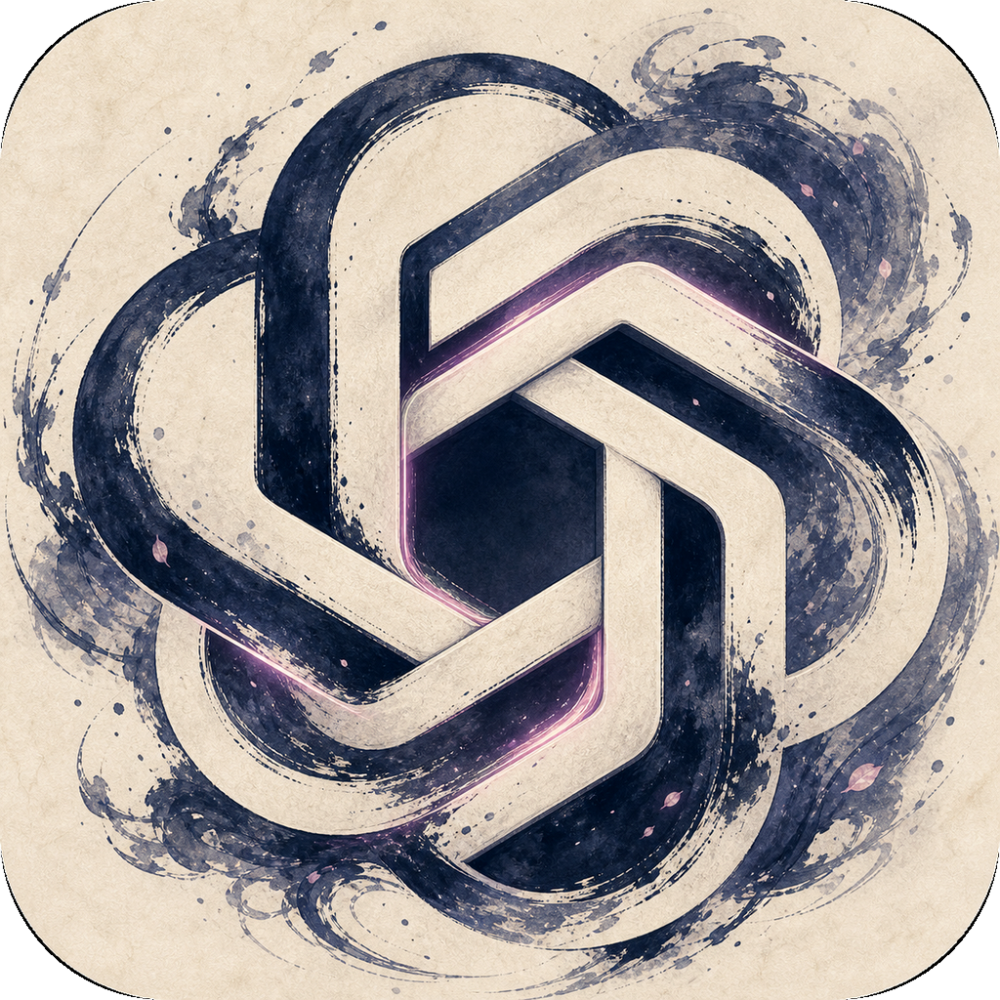
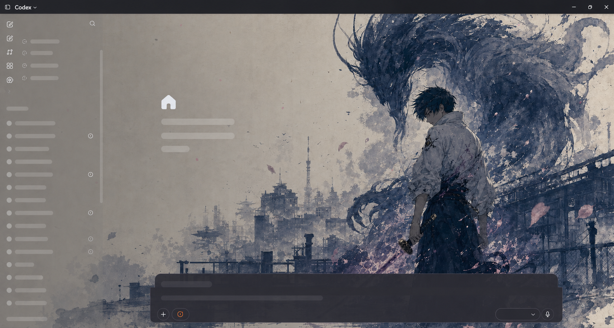
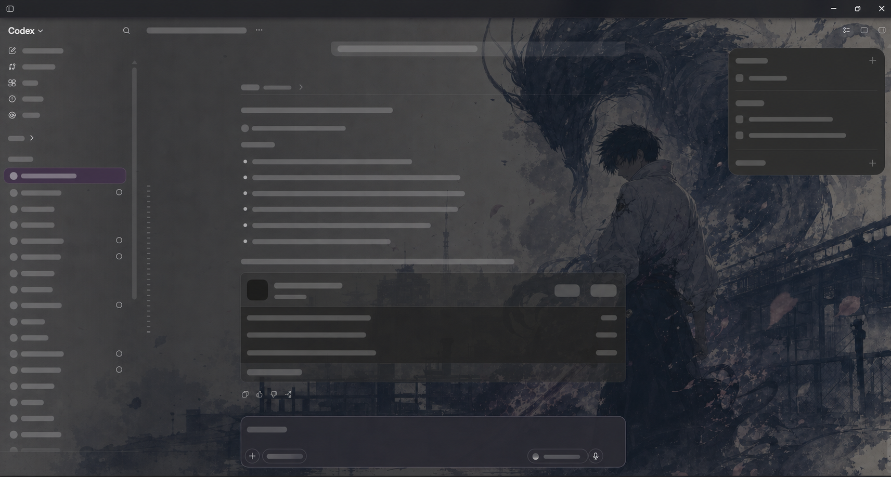

# 落樱 for Codex

> 面向 Windows 的 Codex 桌面端主题启动器。原生交互不变，主题可还原，不改官方安装目录。

> **仅支持 Windows。** 本项目为 Microsoft Store 版 Codex Windows 桌面应用设计；macOS 与 Linux 不在支持范围内。

当前发布版：[v1.1.1](https://github.com/syiibfs-hash/ritual-ink-codex-theme-launcher/releases/tag/v1.1.1)。开发环境基线为 `OpenAI.Codex 26.715.7063.0`；Codex 更新可能调整界面 DOM，升级后请先运行自检并提交兼容性反馈。


`落樱` 是内置示例主题：水墨、深蓝与落樱构成的生成式壁纸，搭配定制桌面/缩略图图标，以及低开销的樱花动态效果。该名称仅是主题标签，不指向或声称代表任何角色、作品或权利方。

## 主要特点

| 功能 | 说明 |
| --- | --- |
| Windows 专用 | 面向 Microsoft Store 官方 Codex Windows 桌面应用的窗口、快捷方式与任务栏行为设计。 |
| 精美主题 | 一张纯壁纸覆盖主题氛围；首页突出画面，任务页自动降噪，避免影响阅读与输入。 |
| 个性化图标 | 桌面快捷方式与任务栏缩略图使用主题图标；固定任务栏按钮保持官方 Codex 图标，避免 Windows 应用身份混乱。 |
| 樱花动态特效 | 26 个 CSS 粒子，仅使用 `transform` 与 `opacity` 动画；无 Canvas、不拦截点击，并尊重“减少动态效果”系统设置。 |
| 原生交互 | 侧栏、项目选择、任务内容、输入框和菜单仍是官方 Codex 的真实控件，不是整窗截图。 |
| 宠物兼容 | 自动跳过透明宠物悬浮窗，避免主题背景覆盖宠物窗口。 |
| 无感启动 | 快捷方式通过隐藏运行器启动，不显示 PowerShell、Node、托盘图标或额外窗口。 |
| 随时还原 | 关闭主题注入即可恢复官方外观；不会修改官方文件。 |

<p align="center">
  
</p>

## 主题实机示例

下列为 Windows 版 Codex 的实际主题效果。已移除任务标题、会话内容、账户信息、本机路径和后台输出，仅保留通用界面占位内容用于展示布局与主题表现。

### 首页



### 任务页



## 安全边界

- **不修改** `WindowsApps`、`app.asar`、官方安装目录或代码签名。
- **不会**自动改写 API Key / Base URL；中转配置与换肤功能相互独立。
- 不修改 Codex 登录信息、任务、插件或应用设置。
- CDP 调试端口只绑定 `127.0.0.1`。该端口没有同用户身份认证，主题运行期间请勿运行不可信的本机程序。
- 本项目不是 OpenAI 官方产品，也不受 OpenAI 认可或赞助。

## 运行要求

- Windows 10 或 Windows 11；本项目不支持 macOS 或 Linux。
- 已为当前 Windows 用户注册的 Microsoft Store 官方 `OpenAI.Codex` 应用。
- `PATH` 中可用的 Node.js 22 或更高版本。
- Windows PowerShell 5.1 或更高版本。

## 让 Codex 自动安装「落樱」

无需手动打开终端。复制 [Codex 安装与自定义提示词](docs/CODEX_PROMPTS.md) 中的“安装当前预设：落樱”内容并发送给 Codex；Codex 会下载固定版本的发布包、校验 SHA-256，再执行本仓库的安装器。

安装得到的就是本仓库当前内置预设 **落樱**，不会自动改写 API Key、Base URL、`WindowsApps` 或 `app.asar`。若要按参考图片创建新主题，使用同一文档中的“根据参考图创建自定义主题”提示词。

## 安装

在仓库根目录运行：

```powershell
powershell -NoProfile -ExecutionPolicy RemoteSigned -File .\install.ps1 -ShortcutName "Codex - 落樱"
```

安装器会将运行时复制到 `%LOCALAPPDATA%\CodexThemeLauncher\engine`，初始化 `%LOCALAPPDATA%\CodexThemeLauncher\active-theme`，并创建隐藏启动的快捷方式。之后通过生成的 `Codex` 快捷方式进入主题版。

若 Codex 已以非主题方式打开，快捷方式会重启它以开启仅本机可访问的 CDP 端口；未发送的输入内容可能丢失。

## 自定义主题

最快方式是准备一张没有 UI、文字、按钮或水印的纯壁纸，然后运行：

```powershell
powershell -NoProfile -ExecutionPolicy RemoteSigned -File "$env:LOCALAPPDATA\CodexThemeLauncher\engine\scripts\set-background.ps1" `
  -ImagePath "C:\path\to\your-wallpaper.jpg" `
  -Variant dark `
  -Accent "#c58ac8"
```

支持 `.svg`、`.jpg`、`.jpeg`、`.png`、`.webp`、`.gif`，文件不超过 16 MB。主题名称、焦点、安全区、任务页表现，以及可直接粘贴给 Codex 的中文提示词，见 [自定义主题指南](docs/CUSTOM_THEME_GUIDE.md)。

## 还原官方外观

关闭 Codex 后执行：

```powershell
powershell -NoProfile -ExecutionPolicy RemoteSigned -File "$env:LOCALAPPDATA\CodexThemeLauncher\engine\scripts\restore-codex-skin.ps1"
```

## 归属与素材声明

本仓库的主题 CSS 与渲染注入器在 [Fei-Away/Codex-Dream-Skin](https://github.com/Fei-Away/Codex-Dream-Skin) Windows 实现基础上进行了修改，遵循随仓库附带的 MIT 许可证。具体来源、软件许可与示例素材的独立权利声明见 [NOTICE.md](NOTICE.md)。

示例壁纸、图标和宣传截图由维护者创作，可作为本仓库、其 Fork 或正式发布包的一部分公开再分发；它们不包含在 MIT 软件许可证中，也不可被单独转售或单独授权。详细范围见 [素材声明](assets/ARTWORK_NOTICE.md)。

## 维护与安全

- 安全问题请遵循 [SECURITY.md](SECURITY.md)，不要在公开 Issue 中附带敏感信息。
- 安装、兼容性和文档问题可通过 Issue 提交；贡献流程见 [CONTRIBUTING.md](CONTRIBUTING.md)。
- 发布构建和校验步骤见 [docs/RELEASE.md](docs/RELEASE.md)。
